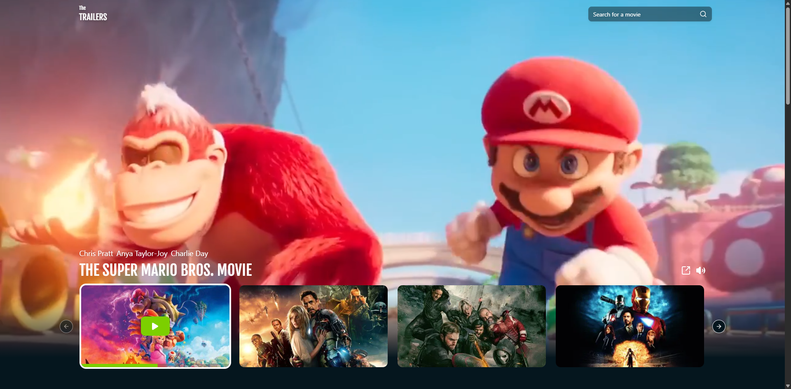
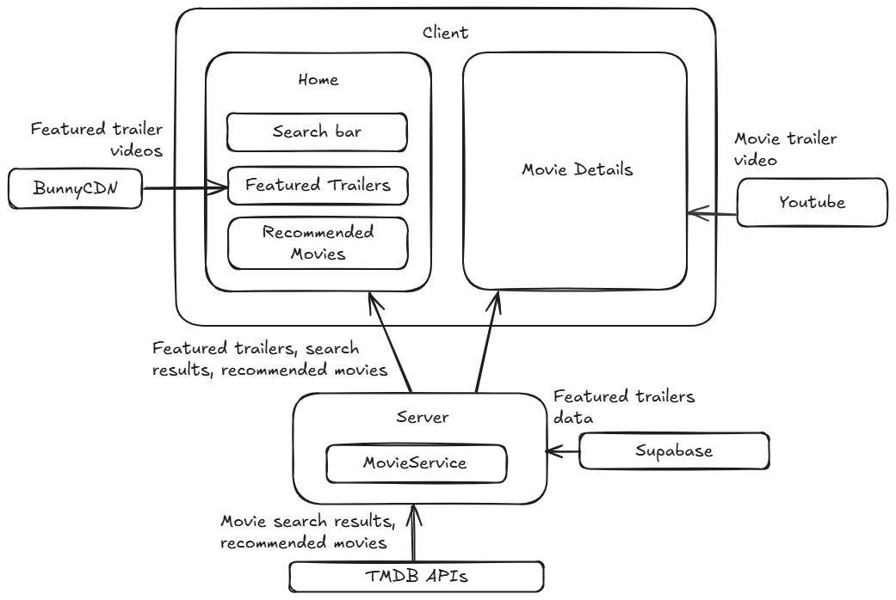
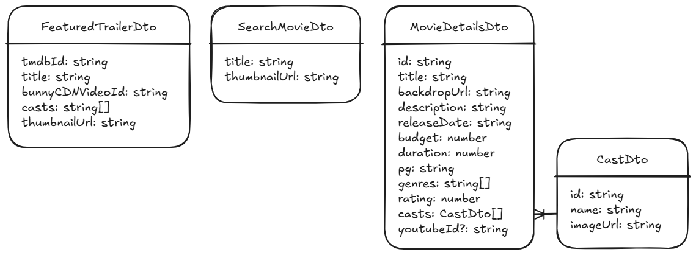

# The Trailers

**The Trailers** is a movie trailer streaming website. The design is based on [The Trailers (from Dribble)](https://dribbble.com/shots/20409351-TheTrailers-Mockup)

_Disclaimer: This is just a case study, not for production use._

### Demo

[The Trailers](https://the-trailers.vercel.app)

### Tech Stack

- Next.js
- ShadCN UI
- Tailwind CSS
- BunnyCDN
- Supabase
- PostgreSQL
- TMDB API

### System Design

- Supabase - Stores the featured trailers data shown in the home hero banner section.
- BunnyCDN - Streams the featured trailer videos.
- TMDB - Fetches movie data.
- Youtube - Streams movie trailer video for non-featured trailers.

**Featured trailers are stored separately because TMDB does not provide an API that returns trailer videos that can be played using the HTML video player. So, the featured trailers are stored in BunnyCDN instead.*

### Data Transfer Objects

- FeatureTrailerDto - For featured trailers in the home hero banner section.
- SearchMovieDto - For search movie results.
- MovieDetailsDto - For movie details.

### API Endpoints

**getFeaturedTrailers()** - Returns a list of 10 random featured trailers.

**getSectionTrailers(sectionType)** - Returns a list of movies in a section. Section types are: now_playing, popular, top_rated, upcoming. The results are retrieved from TMDB.

**searchMovies(query)** - For performing search queries.

**getMovieDetails(id)** - Returns movie details from TMDB.

### Future Improvements

- Add registration and authentication.
- Add functionality to rate a movie.
- Add functionality to save a movie to watchlist and view watchlist.
- Add functionality to add a movie to favorites and view favorites.