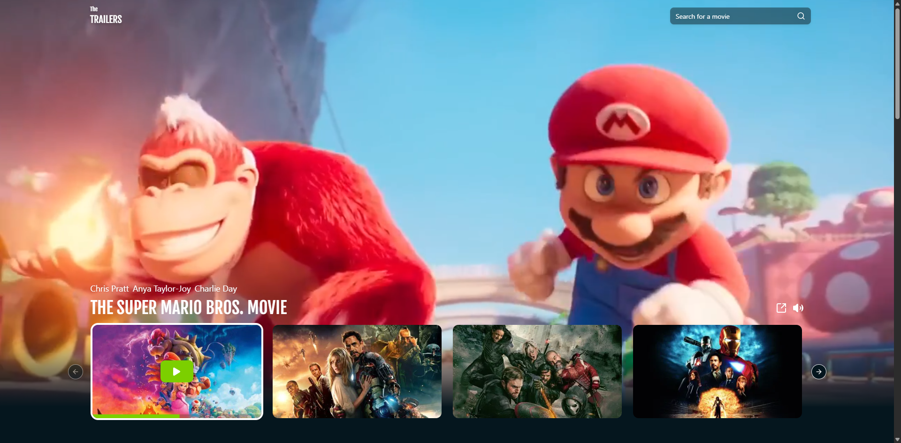
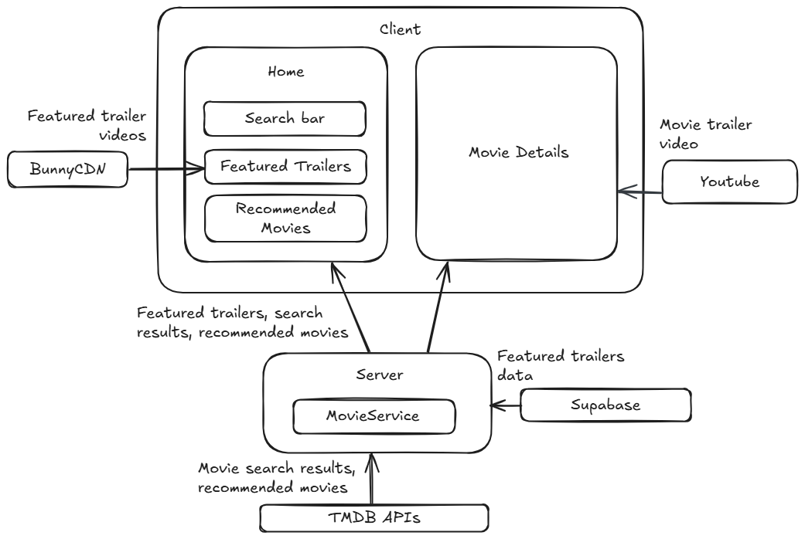
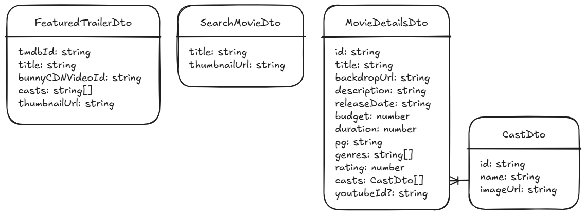

# The Trailers

**The Trailers** is a movie trailer streaming website. The design is based on [The Trailers (from Dribble)](https://dribbble.com/shots/20409351-TheTrailers-Mockup)

_Disclaimer: This is just a case study, not for production use._

### Demo

[The Trailers](https://the-trailers.vercel.app)

### Tech Stack

- Next.js
- ShadCN UI
- Tailwind CSS
- BunnyCDN
- Supabase
- PostgreSQL
- TMDB API

### System Design

#### Components Diagram

- Supabase - Stores the featured trailers data shown in the home hero banner section.
- BunnyCDN - Streams the featured trailer videos.
- TMDB - Fetches movie data.
- Youtube - Streams movie trailer video for non-featured trailers.

**Featured trailers are stored separately because TMDB does not provide an API that returns trailer videos that can be played using the HTML video player. So, the featured trailers are stored in BunnyCDN instead.*

#### Data Transfer Objects

- FeatureTrailerDto - For featured trailers in the home hero banner section.
- SearchMovieDto - For search movie results.
- MovieDetailsDto - For movie details.
